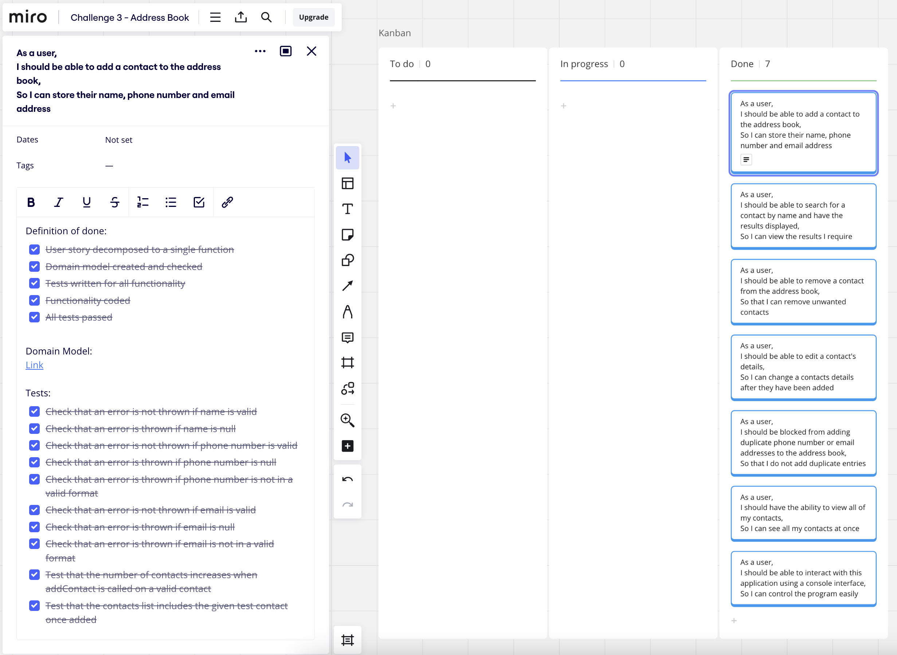
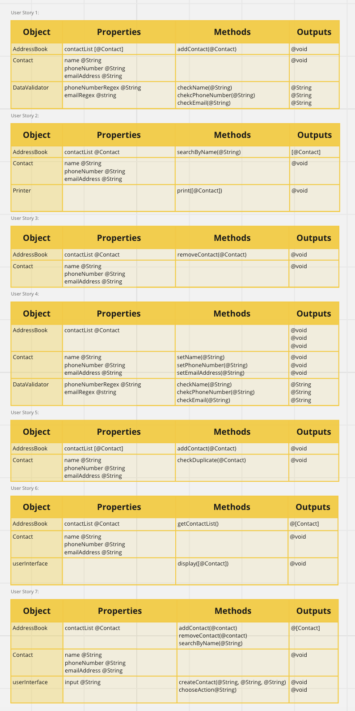

# Address Book Documentation

## Benefits of the software
### Introduction
According to security software firm BullGuard, the average Brit has over 50 contacts in their mobile phone [1], an unfeasibly large number to remember without aid; The research, in fact, goes on to say that the people in the UK only remember two contact’s phone numbers on average in full. With this in mind, the use case for a software address book is clear; A simple, easy to access and edit way to store and view the details of your contacts.
### Key Features
- The user can add a contact to the address book, where a contact has at least a name, phone number and email address.
- The user can search for a contact by name and have the results displayed.
- The user can remove a contact from the address book.
- The user can edit a contact's details once they are already in the address book.
- The user is blocked from accidentally adding duplicate contacts.
- The user can view all contacts in the address book at once.
- A simple console interface so an untrained user can interact with the program.
### Benefits of the software
The software allows the user to store as many contacts as the memory of their device allows, and view, add, edit and remove them as desired. This means that they are able to access these details at a moment's notice and update them in line with real world changes. Compared to not using any software address book solution, the ability to search for contacts saves time flicking through a traditional physical address book, as well as error correction from the functionality of the programme to not allow incorrect phone numbers and email addresses, and to block the entry of duplicate contacts.
### Risks
Although an address book is a notably low risk piece of software, it is still worth noting that human error can cause incorrect contact entry. For example, an incorrect phone number can be added to the software as long as it follows phone number convention, so it remains important to confirm that details are correct. The program does take measures to reduce the impact of this, by both showing the inputted data to the user for confirmation before anything is added to the address book, as well as allowing the removal and editting of contacts.
### Further Development
<b>Better search:</b> Expanding the functionality of the address book to allow searching for phone numbers and email addresses in a combined search is a key development goal to allow users to find the information that they are looking for more easily. 
<b>User Interface Improvements:</b> A main aim for the future of the software is to include a graphical user interface to allow easier access to controls and information for the end user. 
<b>Offline Contact Storage:</b> By writing the address book’s contact list to a drive, the contents can be maintained even when the device on which the program is being run is offline.
### Conclusion
Although there are some major development goals in the near future, the software in its current form entirely fulfils all expected user requirements. Any risks discussed earlier can be considered minimal, having been considerably mitigated by the functionality of the program. It therefore represents a large improvement to quality of life for any users who adopt it for contact storage.

[1]https://www.telegraph.co.uk/technology/mobile-phones/9428917/Britons-have-50-contacts-in-mobile-phone-but-have-memorised-just-two-numbers.html

## Domain Models and Test Plan

### Use of Agile for Project Planning

A kanban board was used to track progress on this project. A screenshot of this has been included, showing an example of a user story written out, with its domain model linked and a 'definition-of-done' included for tracking and project management purposes.

### User Stories

#### Core Features

User Story 1:

- As a user,
- I should be able to add a contact to the address book,
- So I can store their name, phone number and email address.

User Story 2:

- As a user,
- I should be able to search for a contact by name and have the results displayed,
  So I can view the results I require.

User Story 3:

- As a user,
- I should be able to remove a contact from the address book,
- So that I can remove unwanted contacts.

User Story 4:

- As a user,
- I should be able to edit a contact's details,
- So I can change a contacts details after they have been added.

User Story 5:

- As a user,
- I should be blocked from adding duplicate phone number or email addresses to the address book,
- So that I do not add duplicate entries.

User Story 6:

- As a user,
- I should have the ability to view all of my contacts,
- So I can see all my contacts at once.

User Story 7:

- As a user,
- I should be able to interact with this application using a console interface,
- So I can control the program easily.

### Domain Models

The domain models used for the core features can be seen here:

### Testing

JUnit was used to test this application as it was being developed. Below is a full list of the tests, grouped by class.

#### Contact Tests:
Contact Constructor Tests:
- Name is set by constructor
- Phone number is set by constructor
- Email is set by constructor

#### AddressBook Tests:
Add Contact Tests:
- Test that the number of contacts increases when addContact is called
- Test that the contacts list includes the given test contact

Remove Contact Tests:
- Test that the number of contacts decreases when removeContact is called
- Test that the contacts list does not include the given test contact
- Test that removeContact() throws an error if contacts list does not contain the given contact

Search By Name Tests:
- Check that the returned list of contacts includes a contact with the requested term
- Check the search result is empty if the term does not match any statements
- Check that the returned list of contacts includes a contact with the requested term if cases are different
- Check that the returned list of contacts is size 2 if 2 results are expected

Edit Contact Tests:
- Check that the returned list of contacts does not include the original contact after editing
- Check that the returned list of contacts does include the new contact after editing

Duplicate Tests:
- Check that an error is thrown if a duplicate is added
- Check that an error is thrown if a duplicate phone number is added with different email and name
- Check that an error is thrown if a duplicate email is added with different phone number and name
- Check that an error is not thrown if a duplicate name is added with different phone number and email
- Check that an error is not thrown if two entries are not duplicates

Return All Tests:
- Check that the returned list of contacts is empty when no contacts are added
- Check that the returned list of contacts is size 1 when 1 contacts are added
- Check that the returned list of contacts is size 2 when 2 contacts are added

#### DataValidator Tests:
Name Tests:
- Check that an error is not thrown if name is valid
- Check that an error is thrown if name is null

Phone Number Tests:
- Check that an error is not thrown if phone number is valid
- Check that an error is thrown if phone number is null
- Check that an error is thrown if phone number is not in a valid format

Email Tests:
- Check that an error is not thrown if email is valid
- Check that an error is thrown if email is null
- Check that an error is thrown if email is not in a valid format

#### UserInterface Tests:

Start:
- Check that the menu is printed on startup, and closes on an input of 6

Add Contact Tests:
- Check that a contact is added successfully when the details are correct 
- Check that an email error message is sent if an incorrect email is entered 
- Check that a phone number error message is sent if an incorrect phone number is entered  
- Check that a duplicate contact cannot be added

Search by name tests:
- Test that a contact which has been added can be found in a search 
- Test that the search only shows relevant results

Show all contacts tests:
- Test that option 2 starts show all contacts 
- Test that option 2 shows a contact when one is added 
- Test that option 2 shows both contacts when two are added 
- Test that option 2 shows both contacts in order when two are added

Remove contact tests:
- Test that a contact which has been added can be removed
- Test that a contact which does not exist cannot be removed

Edit contact tests:
- Test that a contact which has been added can be edited
- Test that invalid data is not accepted
